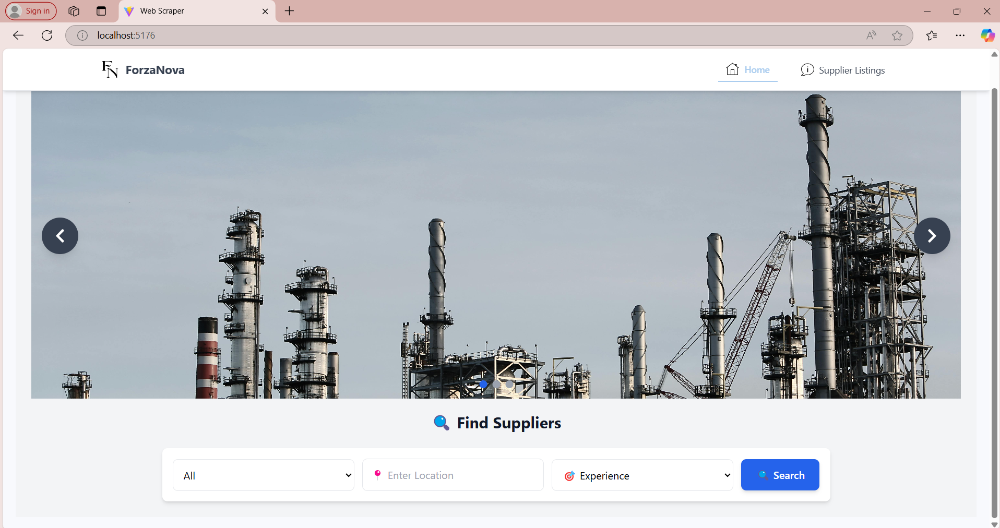
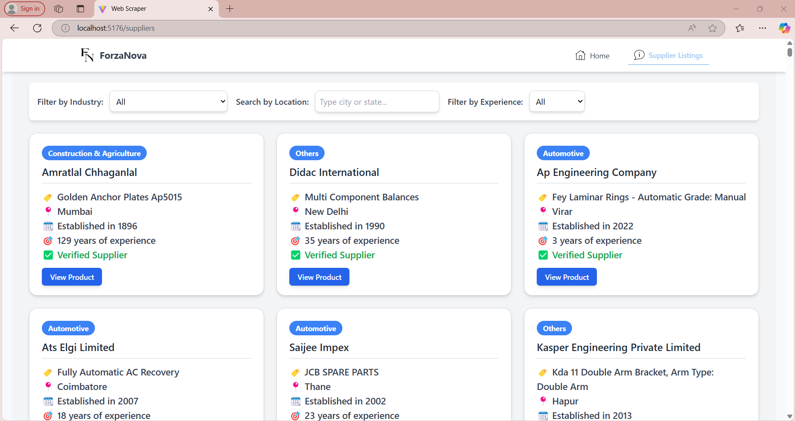

# TradeIndia Supplier & Product Scraper

A web scraper designed to extract and display detailed product and supplier information from [TradeIndia](https://www.tradeindia.com/). This allows users to search and filter suppliers based on Industry Type, Location, and Experience. The scraped data is stored in an Excel file and displayed dynamically on a React-based web application.

---

## Features

- **Web Scraping**: Extracts product details and supplier information from TradeIndia.
- **Data Storage**: Saves scraped data in an Excel file.
- **React Web Application**: Displays the scraped data in a user-friendly web interface.
- **Filtering Options**: Users can filter suppliers based on:
  - Industry Type
  - Location
  - Experience
- **Product Redirect**: Direct links to product pages on TradeIndia.
- **Responsive Design**: Optimized for different screen sizes.

---
## Screenshots

### **Home Page**


### **Suppliers Page**


---

## Technologies Used

### Backend (Scraping & Data Handling)
- **Python**:
  - Selenium & BeautifulSoup for web scraping.
  - Pandas for data processing and saving to Excel.
  - Requests for HTTP requests.

### Frontend (Web Interface)
- **React.js**:
  - Tailwind CSS for styling.
  - React Router for navigation.

---

## Project Workflow

1. **Scraping Product URLs**:
   - `productListScraper.py` scrapes product URLs and saves them in `tradeIndia_Industry_Products.xlsx`.

2. **Scraping Detailed Product Data**:
   - `productDetailsScraper.py` extracts supplier details like name, location, experience, and trust status.
   - Stores data in `data.xlsx`.

3. **Frontend Display**:
   - React app loads the Excel data and allows users to filter suppliers dynamically.

---

## Folder Structure

```
dashboard
│
├── public                      # Static assets and scraped data
│   ├── data.xlsx
│   ├── tradeIndia_Industry_Products.xlsx
│   ├── vite.svg
│
├── src                         # Source code
│   ├── assets                  # Images and other assets
│   ├── components              # Reusable UI components
│   │   ├── carousel.jsx
│   │   ├── Navbar.jsx
│   │   ├── chromedriver.exe    # WebDriver for Selenium
│   ├── context                 # Global state management
│   ├── pages                   # Page components
│   │   ├── Home.jsx
│   │   ├── Suppliers.jsx
│   ├── scraper                 # Web scraping scripts
│   │   ├── productDetailsScraper.py
│   │   ├── productListScraper.py
│   ├── App.jsx                  # Main React component
│   ├── index.css                # Global styles
│   ├── main.jsx                 # Application entry point
│
├── .env                        # Environment variables
├── .gitignore                  # Git ignore file
```

---

## Installation & Setup

### 1. Clone the Repository
```bash
git clone https://github.com/kirtanshah24/Web-Scraper.git
cd dashboard
```

### 2. Install Dependencies
#### Python (Web Scraping)
Ensure you have Python installed


#### React (Frontend)
Ensure Node.js and npm are installed, then run:
```bash
npm install
```

### 3. Run Web Scraper
```bash
python scraper/productListScraper.py
python scraper/productDetailsScraper.py
```
This will generate `data.xlsx` with supplier details.

### 4. Start React Application
```bash
npm start
```
The application runs at `http://localhost:5176/`.

---

## How to Use

1. **Access the Home Page**: View supplier and product listings.
2. **Apply Filters**: Filter suppliers based on industry, location, and experience.
3. **View Product Details**: Click "View Product" to open the TradeIndia page.

---

## Contributing

1. Fork the repository.
2. Clone your fork:
   ```bash
   git clone https://github.com/kirtanshah24/Web-Scraper.git
   ```
3. Create a new branch:
   ```bash
   git checkout -b feature-branch
   ```
4. Make changes and commit:
   ```bash
   git commit -m "Added a new feature"
   ```
5. Push changes:
   ```bash
   git push origin feature-branch
   ```
6. Create a pull request.

---

## License

This project is licensed under the MIT License.

---

## Acknowledgments

- **Selenium** - Web automation.
- **BeautifulSoup** - HTML parsing.
- **React.js** - Frontend framework.
- **Tailwind CSS** - Styling.
- **TradeIndia** - Data source.

